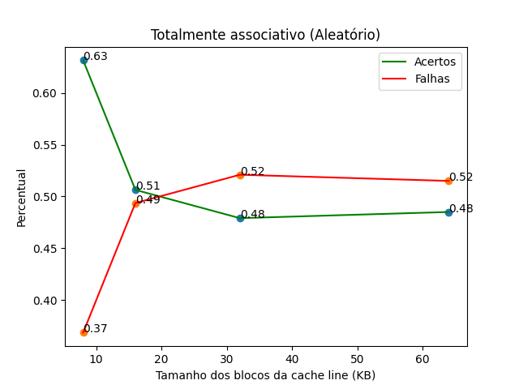

<h1 align="center">
  CacheSim AC • Memória Cache - Atividade 5
</h1>

  <b>Universidade Federal do Rio Grande do Norte (UFRN)</b>  
  <b>Centro de Tecnologia - Departamento de Engenharia de Computação e Automação (DCA)</b>

- **Disciplina:** DCA0104 – Arquitetura de Computadores
- **Professor:** Diogo Pinheiro Fernandes Pedrosa

---

Este repositório consiste em construir uma simulação de um sistema computacional com cache única entre processador e memória principal para testar várias configurações de projetos de cache e, com isso, obter as taxas de acertos e falhas existentes. Para seu desenvolvimento foi utilizado a biblioteca [pyCacheSim](https://github.com/RRZE-HPC/pycachesim). 

As simulações versam sobre um sistema hipotético com uma memória principal de 64K bytes de tamanho, endereçada a byte (ou seja, o tamanho da palavra desse sistema é igual a 1 byte). Esse sistema é de um único processador, com uma cache simples de dados (cache única), de 4K bytes de tamanho.

Para as simulações foram utilizados dados de referências que estão presentes no arquivo de referêcia [1](./data/reference-1.txt) e [2](./data/reference-2.txt).

Para cada uma dessas sequências (também chamada de traço da memória), foi simulado:

1. Uma cache diretamente mapeada, com blocos de 8, 16, 32 e 64 bytes, respectivamente; e
2. Uma cache associativa em conjunto com 2, 4, 8 e 16 vias, sendo que cada uma delas apresenta blocos de 8, 16, 32 e 64 bytes, respectivamente.

Para o caso da simulação com cache associativa em conjunto, foram testados as três políticas de
substituição de linha (LRU, FIFO e aleatória).

Já para a simulação de uma cache totalmente associativa, consideramos uma configuração diferente: cache única de dados, de 1K bytes de tamanho, com linhas armazenando 8, 16, 32 e 64 bytes, respectivamente.

Ou seja, foram realizadas 4 (mapeamento direto) + 16 (associativo em conjunto) + 4 (totalmente associativo) simulações diferentes. Em cada uma delas, foi obtido as taxas de acerto e de falha de cache. Esses resultados são gerados automaticamente e armazenados no csv presente [aqui](./data/result.csv). 

Com base nos dados obtidos foi possível realizar a construção de gráficos por meio da biblioteca [MathPlotLib](https://matplotlib.org/) para facilitar a leitura e interpretação dos dados. Esses gráficos estão presentes na tabela abaixo e, neles, é possível efetuar um comparativo entre a taxa de erros e acertos para cada configuração.

|-| -|
|:-:|:-:|
|||
|||
|||
|| - |